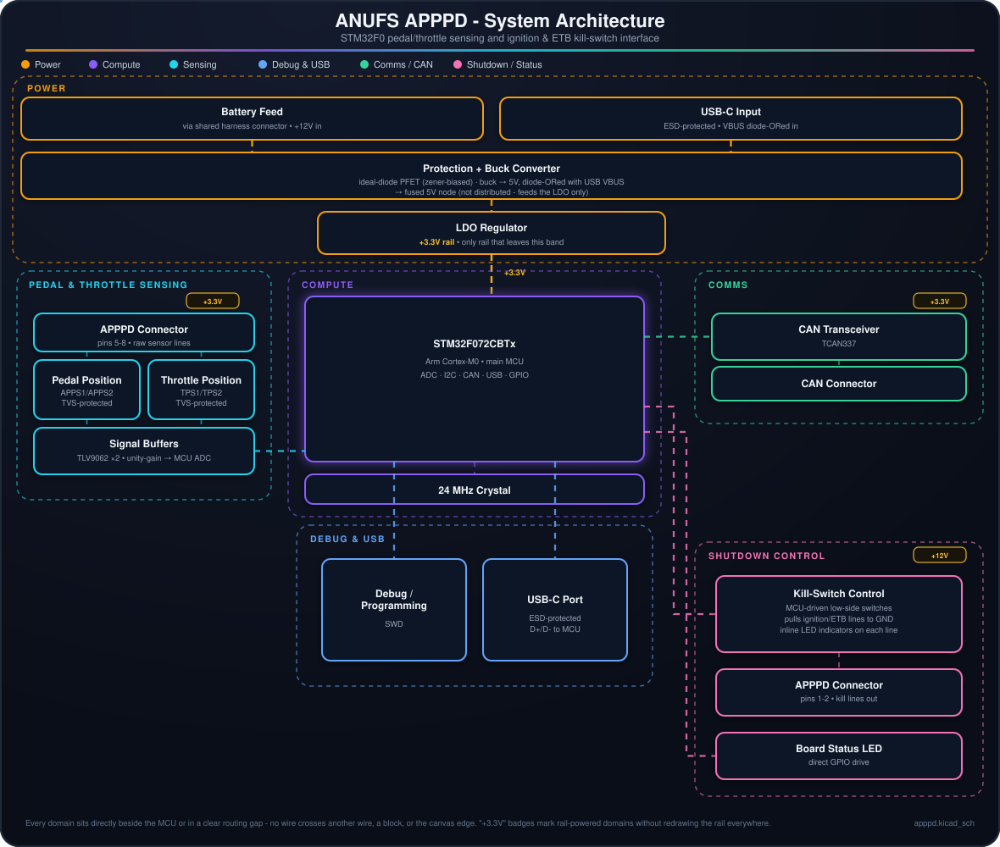

# ANUFS APPPD

  

Accelerator pedal position (APPS) and throttle position (TPS) sensor interface for the ANUFS vehicle, with dual-redundant sensing, ignition/electronic-throttle-body kill-switch control, and CAN reporting. A single 8-pin harness connector carries power in, both raw sensor pairs, and the two kill lines out.

## Architecture

- **Power** - the LV battery feed arrives on the shared harness connector, passes through an ideal-diode PFET (Zener-biased) for reverse-polarity/surge protection, and feeds `U6` (LMR33610), which bucks it to 5V. That 5V is diode-ORed with USB-C VBUS onto a single fused node that only ever feeds `U1` (AP2112K-3.3) - the **+3.3V rail is the only supply that leaves the power stage**, reaching the MCU, CAN transceiver, both op-amps and the status LED.
- **Pedal & throttle sensing** - the harness carries two raw accelerator-pedal signals (APPS1/APPS2) and two raw throttle-position signals (TPS1/TPS2), each individually clamped by an automotive `AQ1005-01ETG` TVS array. `U5` and `U7` (`TLV9062` dual op-amps) buffer them with unity gain straight into the MCU's ADC inputs.
- **Compute** - `U2`, an STM32F072CBTx (Cortex-M0), is the hub, clocked from a 24MHz crystal (`Y1`).
- **Shutdown control** - the MCU drives two low-side MOSFETs (`Q1` for ignition, `Q2` for electronic throttle body) that pull the corresponding harness line to ground to trip the external kill relay. Each line has an inline LED (`D3`, `D5`) that lights while its kill switch is active, so the cut state is visible without a laptop. A separate GPIO-driven LED (`LED1`) gives a general board heartbeat/fault indication.
- **Comms** - a `TCAN337` transceiver (`U4`) puts pedal/throttle status and kill-line faults on the vehicle CAN bus via `J4`.
- **Debug & USB** - USB-C (`J5`, ESD-protected by `U3`) for bench debug/firmware and D+/D- to the MCU; `J1` (Conn_SWD) for programming.

The diagram above is a live SVG: dashed lines show active power/signal paths, and the small dots trace the flow through each domain (open `assets/architecture.svg` directly if your viewer doesn't animate it).

## Repo contents

- [KiCad project](apppd.kicad_pro)
- [Schematic](apppd.kicad_sch)
- [PCB layout](apppd.kicad_pcb)
- [Bill of materials](APPPD_DigiKey_BOM.xlsx)

